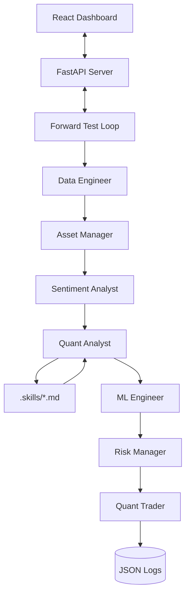

# SKANDA: AI Quantitative Trading System - System Specification

## 1. Agents and Interaction Structure

Skanda is built on a **ReAct (Reason + Act)** multi-agent framework. Unlike linear execution systems, each agent in Skanda maintains internal "thoughts" and "actions," allowing for complex reasoning before making trade decisions.

### Agent Interaction Flow
The system follows a sequential yet collaborative pipeline:

1.  **Data Engineer**: Ingests high-fidelity OHLCV data from CCXT (e.g., Binance) and prepares a standardized multi-coin panel.
2.  **Asset Manager**: Performs statistical analysis on the panel to identify **Lead-Lag** relationships using cointegration.
3.  **Sentiment Analyst**: Processes macro news and technical descriptions using **FinBERT** to provide a normalized sentiment score [-1, 1].
4.  **Quant Analyst**: The core "Signal Generator." It selects the active strategy (EMA, RSI, etc.) and evaluates market conditions to propose a trade.
5.  **ML Engineer**: Acts as the "Probability Guard." It validates the Quant Analyst's proposal using **CatBoost** to assign a win probability.
6.  **Risk Manager**: The "Final Veto Authority." It checks for signal freshness (Alpha Decay) and tracks consecutive failures using **Mem0** memory.
7.  **Quant Trader**: Executes the approved trade on the paper-trading exchange and logs the result to the history and wallet.
8.  **User Proxy**: Manages the interface between the agent swarm and the UI, announcing strategy changes and risk alerts.

---

## 2. Complete Workflow Example: BTCUSDT Cycle

To illustrate the system in action, here is a walkthrough of a single execution cycle:

| Phase | Agent | Input/Context | Action | Result |
| :--- | :--- | :--- | :--- | :--- |
| **Ingestion** | Data Engineer | `BTCUSDT`, `1h` | Fetches 100 bars of OHLCV data. | Standardized data payload. |
| **IQ Scan** | Asset Manager | Multi-coin panel | Engle-Granger scan for `BTC` vs `SOL`, `ETH`. | Identifies BTC lead-lag spread z-score = +2.1. |
| **NLP Scan** | Sentiment Analyst | Macro news text | Runs FinBERT on "Market watching BTC resistance". | Sentiment Score: +0.45 (Bullish). |
| **Signal** | Quant Analyst | OHLCV + Asset Context | Applies `trendline_breakout.md` skill. | **PROPOSAL: BUY BTCUSDT**. |
| **Validation** | ML Engineer | Proposal + Sentiment | CatBoost inference on features. | **Win Probability: 74.5%**. |
| **Safety** | Risk Manager | Win Prob + Memory | Checks Mem0 for recent `Trendline` failures. | **APPROVED** (Decay factor 0.99). |
| **Execution** | Quant Trader | Approved Proposal | Deducts USDT, adds BTC to paper wallet. | Trade logged to `trade_history.json`. |
| **Alert** | User Proxy | Final Status | Sends WebSocket update to React UI. | Dashboard updates Equity Curve. |

---

## 3. Institutional-Grade Techniques & Methods

Skanda utilizes several advanced quantitative methods to ensure stability, precision, and risk mitigation.

### **System Architecture Diagram**

---

## 3. Step-by-Step Workflow

| Step | Action | Description | Files Involved |
| :--- | :--- | :--- | :--- |
| **1** | **Policy Reload** | The engine checks `active_policy.json` for hot-swappable settings (strategy, interval). | `forward_test.py`, `config/active_policy.json` |
| **2** | **Data Ingestion** | Fetches multi-coin OHLCV data for the selected timeframe. | `agents/data_engineer.py` |
| **3** | **Market IQ** | Analyzes lead-lag structures and cross-pair correlations. | `agents/asset_manager.py` |
| **4** | **Sentiment Scan** | Runs FinBERT on news/macro text to generate a sentiment score. | `agents/sentiment_analyst.py` |
| **5** | **Signal Generation** | Quant Analyst applies selected strategy skill (e.g., EMA Cross). | `agents/quant_analyst.py`, `.skills/quant_analyst/*.md` |
| **6** | **ML Validation** | Calculates win probability based on signal quality and market context. | `agents/ml_engineer.py` |
| **7** | **Risk Gating** | Checks for account limits and consecutive veto "strikes" using memory. | `agents/risk_manager.py` |
| **8** | **Execution** | Approved trades are executed; wallet balances and history are updated. | `agents/quant_trader.py`, `logs/*.json` |
| **9** | **Real-time Sync** | Logs are streamed to the UI via WebSockets for live monitoring. | `server.py`, `logs/agent_stream.log` |

---

## 4. Complete Tech Stack

### **Backend & Engine**
- **Language**: Python 3.10+
- **Framework**: FastAPI (API layer) & Uvicorn (Server)
- **Data Science**: Pandas, NumPy, Pandas-TA (Technical analysis)
- **API/Trading**: CCXT (Crypto Currency eXchange Trading Library)

### **Intelligence & Data**
- **Machine Learning**: CatBoost, PyTorch, Transformers (HuggingFace).
- **Quantitative**: Statsmodels (Cointegration), Pandas-TA (Technical Indicators).
- **Memory**: Mem0, ChromaDB, Sentence-Transformers.

### **Frontend & Visualization**
- **Build Tool**: Vite.
- **Styling**: Vanilla CSS + Tailwind CSS 4.
- **Icons**: Lucide React.
- **Charts**: Recharts (Live Equity/PnL visualization).

### **Persistence**
- **Database**: Local JSON (Logs/Policy), ChromaDB (Vector Embeddings).
- **Logging**: Python `logging` streamed via WebSockets.
